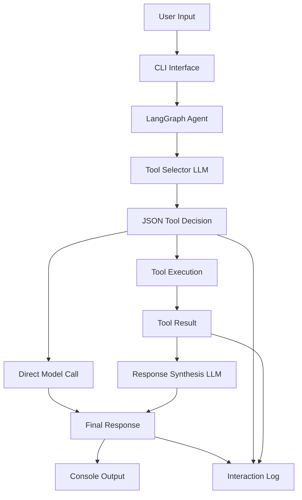
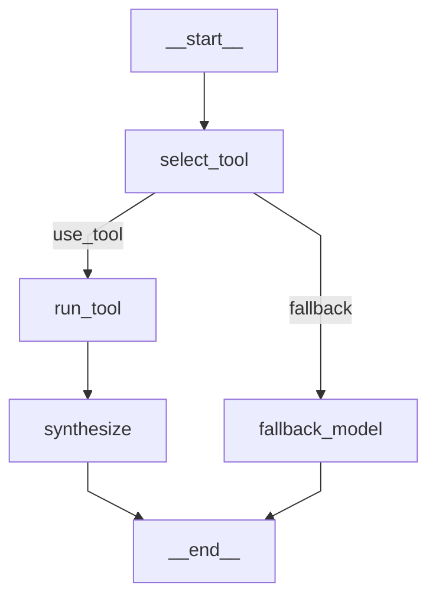
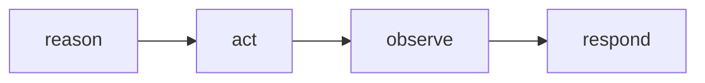

# Architecture Overview

This document describes the architecture of the agent system implemented in this repository.

The system demonstrates a minimal but practical agent workflow that combines model reasoning with deterministic tool execution.

The current implementation uses LangGraph to orchestrate the execution flow.

---

# High Level Architecture

This diagram shows the overall system architecture.

User requests enter through the CLI.
The CLI invokes the LangGraph agent which orchestrates reasoning and tool execution.

The agent may either execute a tool or fall back to a direct model response.

---

# LangGraph Execution Workflow

Nodes in the graph:

**select_tool**
- Uses an LLM to determine whether a tool should be used.

**run_tool**
- Executes a deterministic Python tool.

**synthesize**
- Uses the LLM to convert tool output into a user friendly response.

**fallback_model**
- Directly queries the model when no tool is appropriate.

This creates a simple agent reasoning loop:

The graph structure allows additional nodes to be added easily as the system evolves.

---

# Core Components

## CLI

The CLI provides a simple interactive interface where users can enter prompts and commands.

Examples include:

- help
- list tools
- show tool descriptions
- analyze backlog

The CLI invokes the LangGraph agent to process requests.

---

## LangGraph Agent

LangGraph orchestrates the agent execution workflow.

The graph manages:

- tool selection
- conditional branching
- tool execution
- response synthesis

Using a graph structure makes the workflow easier to extend and reason about.

---

## Tool Selector

The tool selector uses an LLM to determine whether a request should be handled by a tool.

It returns structured JSON containing:

- tool
- reason
- confidence

Example response structure:

{
"tool": "kanban_metrics",
"reason": "The user asked about lead time which is a Kanban flow metric",
"confidence": "high"
}

This structured output allows deterministic routing decisions.

---

## Tool Registry

The tool registry stores structured definitions of available tools.

Each tool includes:

- name
- description
- function

This allows the selector to reason about available capabilities.

---

## Tools

Tools are deterministic Python functions that provide domain specific capabilities.

Current examples include:

- Kanban metric explanations
- backlog risk analysis
- backlog analysis using structured backlog data
- platform engineering explanations
- PI planning dependency explanations

Tools allow the agent to access structured knowledge rather than relying only on LLM responses.

---

## Prompt Layer

Prompts are stored separately from code in the prompts directory.

Examples:

- prompts/tool_selector.txt
- prompts/synthesis.txt

Separating prompts from code allows them to evolve independently.

---

# Logging and Observability

Each interaction records:

- user input
- selected tool
- confidence level
- reason for selection
- tool output
- final response

This provides transparency into how the agent made decisions.

---

# Future Evolution

The architecture will evolve in later stages of the project.

Planned improvements include:

DevOps oriented tools for Terraform and CI/CD analysis

Platform engineering assistants for developer onboarding

Compliance and FinOps analysis agents

Human in the loop approval steps for automated changes

These improvements will extend the LangGraph workflow while preserving the same core agent architecture.

