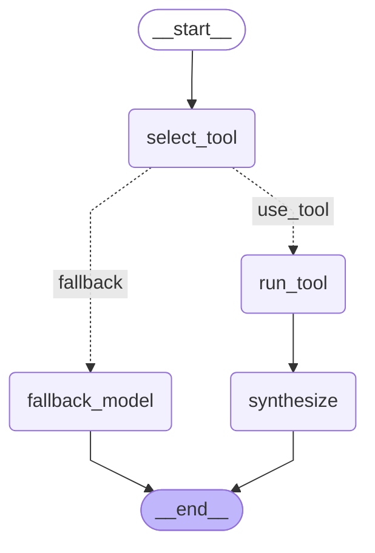

# LangGraph Diagram

```mermaid
---
config:
  flowchart:
    curve: linear
---
graph TD;
	__start__([<p>__start__</p>]):::first
	select_tool(select_tool)
	run_tool(run_tool)
	synthesize(synthesize)
	fallback_model(fallback_model)
	__end__([<p>__end__</p>]):::last
	__start__ --> select_tool;
	run_tool --> synthesize;
	select_tool -. &nbsp;fallback&nbsp; .-> fallback_model;
	select_tool -. &nbsp;use_tool&nbsp; .-> run_tool;
	fallback_model --> __end__;
	synthesize --> __end__;
	classDef default fill:#f2f0ff,line-height:1.2
	classDef first fill-opacity:0
	classDef last fill:#bfb6fc

```
